<a id="top"></a>

<p align="center">

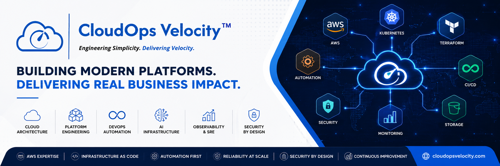

</p>

<h1 align="center">

CloudOps Velocity

</h1>

<p align="center">

<b>Engineering Simplicity. Delivering Velocity.</b>

</p>

<p align="center">

Cloud Execution • Platform Engineering • AI Infrastructure

</p>

<p align="center">


</p>

<p align="center">


</p>

---

<p align="center">

CloudOps Velocity is a cloud engineering and platform engineering consultancy focused on designing, building, automating, securing, and operating modern cloud platforms for startups, growing businesses, and enterprise workloads.

</p>

---

## 📑 Navigation

<p align="center">

<a href="#-overview">📖 <b>Overview</b></a> •
<a href="#-engineering-philosophy">⚙️ <b>Engineering Philosophy</b></a> •
<a href="#-what-we-build">🚀 <b>What We Build</b></a> •
<a href="#-services">☁️ <b>Services</b></a> •
<a href="#-technology-stack">🛠️ <b>Technology</b></a> •
<a href="#-reference-architectures">🏗️ <b>Architecture</b></a>

</p>

<p align="center">

<a href="#-ai-infrastructure">🤖 <b>AI Infrastructure</b></a> •
<a href="#-engineering-case-studies">📚 <b>Case Studies</b></a> •
<a href="#-documentation">📘 <b>Documentation</b></a> •
<a href="#-engineering-roadmap">🗺️ <b>Roadmap</b></a> •
<a href="#-about-cloudops-velocity">🏢 <b>About</b></a> •
<a href="#-contact">📩 <b>Contact</b></a>

</p>

---
<!-- # 📖 Executive Overview -->

CloudOps Velocity was founded with a simple mission:

> **Help organizations build cloud platforms that are secure, scalable, automated, observable, and easy to operate.**

We believe modern infrastructure should accelerate engineering teams—not slow them down.

Our work spans the complete platform lifecycle, from cloud architecture and infrastructure automation to Kubernetes platforms, CI/CD pipelines, AI infrastructure, observability, and production operations.

Rather than delivering isolated cloud services, we focus on building complete engineering platforms that enable teams to ship software faster, operate with confidence, and scale sustainably.

Every solution we design follows modern engineering principles, emphasizing automation, reliability, security, documentation, and continuous improvement.

<p align="right">
<a href="#top">⬆️ Back to Top</a>
</p>

---
<a id="overview"></a>

# 🌍 Overview

CloudOps Velocity is a Cloud Engineering, DevOps, Platform Engineering, and AI Infrastructure consultancy focused on designing, building, securing, and operating production-ready cloud platforms.

We help organizations modernize infrastructure through automation, Infrastructure as Code, Kubernetes, CI/CD, observability, security, and AI-ready platform engineering—enabling teams to deliver software faster, operate reliably, and scale confidently.

<p align="center">

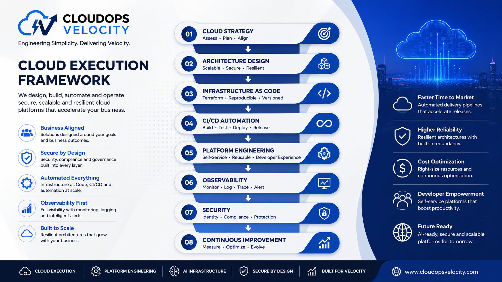

</p>

## Engineering Focus

- ☁ Cloud Execution
- ⚙ Platform Engineering
- 🚀 DevOps Automation
- ☸ Kubernetes Platforms
- 🤖 AI Infrastructure
- 📊 Observability Engineering
- 🔒 DevSecOps
- 📦 Infrastructure as Code

> **"Engineering Simplicity. Delivering Velocity."**

<p align="right">
<a href="#top">⬆ Back to Top</a>
</p>

---
# ⚙️ Engineering Philosophy

Modern cloud platforms should be more than infrastructure—they should serve as reliable, secure, and scalable foundations that enable engineering teams to innovate with confidence.

At CloudOps Velocity, every architecture, deployment pipeline, and operational process is designed around a consistent set of engineering principles that prioritize long-term maintainability over short-term convenience.

These principles guide every solution we build, regardless of project size or industry.

<p align="right">
<a href="#top">⬆️ Back to Top</a>
</p>

---

## 🎯 Our Engineering Principles

| Principle | What It Means |
|------------|---------------|
| 🤖 **Automation First** | Eliminate repetitive manual tasks through Infrastructure as Code, CI/CD, and automated operations. |
| 🔒 **Security by Design** | Integrate security into every layer—from identity management and networking to deployment pipelines and production operations. |
| 📈 **Reliability over Complexity** | Build systems that remain simple, predictable, and resilient under production workloads. |
| ☁️ **Cloud Native Thinking** | Design architectures that leverage modern cloud capabilities for scalability, resilience, and operational efficiency. |
| ⚙️ **Platform Engineering** | Build internal platforms that empower developers to deliver software faster without sacrificing governance or reliability. |
| 📚 **Documentation as Code** | Treat documentation as a core engineering asset that evolves alongside infrastructure and applications. |
| 🏗 **Infrastructure as Code** | Manage cloud infrastructure through version-controlled, repeatable, and auditable automation. |
| 📊 **Observability by Default** | Implement monitoring, logging, tracing, dashboards, and alerting from the beginning—not as an afterthought. |
| 🔄 **Continuous Improvement** | Continuously refine architecture, automation, security, and operational practices based on measurable outcomes. |

<p align="right">
<a href="#top">⬆️ Back to Top</a>
</p>

---

## 🚀 Our Engineering Mindset

We don't simply provision cloud resources or deploy applications.

We engineer complete platforms that allow development teams to build, test, deploy, monitor, and operate software with confidence.

Every engagement focuses on creating systems that are:

- ✅ Secure by default
- ✅ Automated wherever possible
- ✅ Observable from day one
- ✅ Easy to maintain
- ✅ Designed to scale
- ✅ Cost-conscious
- ✅ Production-ready

<p align="right">
<a href="#top">⬆️ Back to Top</a>
</p>

---

## 💡 Our Approach

Every successful platform follows a disciplined engineering lifecycle:

```text
Understand
      │
      ▼
Design
      │
      ▼
Automate
      │
      ▼
Deploy
      │
      ▼
Observe
      │
      ▼
Optimize
      │
      ▼
Continuously Improve
```

Rather than delivering one-time implementations, CloudOps Velocity focuses on building engineering platforms that continue to evolve alongside business growth, technological change, and operational maturity.


---

<p align="center">

> **"Engineering isn't about deploying infrastructure. It's about building reliable platforms that enable businesses to move faster with confidence."**

**— CloudOps Velocity Engineering Philosophy**

</p>

<p align="right">
<a href="#top">⬆️ Back to Top</a>
</p>

---

# 🚀 What We Build

CloudOps Velocity specializes in designing and operating modern cloud platforms that enable organizations to build, deploy, scale, and manage applications with confidence.

Our engineering capabilities span the complete cloud platform lifecycle—from infrastructure design and automation to production operations, observability, and AI infrastructure.

---

## ☁️ Cloud Execution

We design and implement secure, scalable, and highly available cloud environments that provide the foundation for modern applications.

### Capabilities

- AWS Cloud Architecture
- Landing Zone Design
- Multi-Environment Infrastructure
- Virtual Private Cloud (VPC)
- Identity & Access Management (IAM)
- Networking & DNS
- Load Balancing
- Auto Scaling
- Disaster Recovery Planning
- Cost Optimization

---

## ⚙️ Platform Engineering

We build internal developer platforms that enable engineering teams to deliver software faster through standardized infrastructure, automation, and self-service capabilities.

### Capabilities

- Kubernetes Platforms
- Internal Developer Platforms
- Platform Standardization
- GitOps Workflows
- Infrastructure Automation
- Developer Self-Service
- Platform Security
- Production Operations

---

## 🚀 DevOps & Automation

Automation is at the core of every platform we build.

Our delivery pipelines are designed to reduce manual effort, improve deployment reliability, and accelerate software delivery.

### Capabilities

- CI/CD Pipelines
- GitHub Actions
- Jenkins Automation
- Docker
- Infrastructure as Code
- Release Automation
- Deployment Strategies
- Continuous Delivery

---

## 🤖 AI Infrastructure

Modern AI applications require infrastructure that is scalable, observable, and optimized for production workloads.

CloudOps Velocity designs AI-ready platforms capable of supporting the complete machine learning lifecycle.

### Capabilities

- AI Platform Architecture
- GPU Infrastructure
- Model Deployment
- Kubernetes Inference
- Vector Databases
- RAG Infrastructure
- AI API Platforms
- MLOps Foundations

---

## 📊 Observability & Operations

Reliable platforms require complete visibility into infrastructure, applications, and operational health.

We implement observability as a core engineering capability rather than an afterthought.

### Capabilities

- Metrics Collection
- Centralized Logging
- Distributed Tracing
- Alerting
- Dashboards
- Incident Response
- Capacity Planning
- Operational Runbooks

---

## 🔒 Security & Governance

Security is integrated throughout the engineering lifecycle rather than applied at the end of a project.

Every platform is designed with governance, compliance, and operational security in mind.

### Capabilities

- Identity & Access Management
- Network Security
- SSL/TLS
- Secrets Management
- Security Hardening
- Infrastructure Governance
- DevSecOps
- Compliance Readiness

---

## 🎯 Our Goal

Every platform we engineer is designed to be:

- ✅ Secure
- ✅ Scalable
- ✅ Automated
- ✅ Observable
- ✅ Cost Efficient
- ✅ Production Ready
- ✅ Easy to Operate
- ✅ Built for Continuous Growth

<p align="right">
<a href="#top">⬆️ Back to Top</a>
</p>

---

# ☁️ Core Services

CloudOps Velocity delivers end-to-end cloud engineering services that help organizations modernize infrastructure, automate software delivery, improve operational efficiency, and prepare for AI-driven workloads.

Every engagement is tailored to business objectives while following proven engineering practices that prioritize reliability, security, scalability, and operational excellence.

---

## 🏗 Cloud Architecture & Engineering

Designing resilient, secure, and scalable cloud foundations for modern applications.

### Deliverables

- AWS Cloud Architecture Design
- Landing Zone Implementation
- Multi-Environment Infrastructure
- High Availability Architectures
- Disaster Recovery Planning
- Network Architecture
- Cloud Cost Optimization
- Infrastructure Modernization

---

## ⚙️ Platform Engineering

Building internal platforms that enable engineering teams to deliver software faster through standardized infrastructure and automation.

### Deliverables

- Kubernetes Platforms
- Internal Developer Platforms
- GitOps Workflows
- Platform Automation
- Self-Service Infrastructure
- Developer Experience Improvements
- Production Platform Operations
- Platform Standardization

---

## 🚀 DevOps & CI/CD Automation

Accelerating software delivery through reliable and repeatable automation pipelines.

### Deliverables

- CI/CD Pipeline Design
- GitHub Actions
- Jenkins Automation
- Release Automation
- Deployment Pipelines
- Docker Containerization
- Infrastructure as Code
- Continuous Delivery

---

## ☸ Kubernetes & Container Platforms

Building production-ready Kubernetes environments for scalable and cloud-native applications.

### Deliverables

- Kubernetes Cluster Design
- Helm Deployments
- Ingress Controllers
- Service Mesh Foundations
- Autoscaling
- Secrets Management
- RBAC Implementation
- Production Cluster Operations

---

## 🤖 AI Infrastructure

Designing cloud platforms capable of supporting modern AI and machine learning workloads.

### Deliverables

- AI Platform Architecture
- GPU Infrastructure Planning
- Model Deployment Platforms
- Kubernetes Inference
- Vector Database Integration
- RAG Infrastructure
- MLOps Foundations
- AI API Platforms

---

## 📊 Monitoring & Observability

Providing complete visibility into applications, infrastructure, and production environments.

### Deliverables

- Prometheus
- Grafana Dashboards
- ELK Stack
- Datadog Integration
- OpenTelemetry
- Centralized Logging
- Distributed Tracing
- Alerting & Incident Management

---

## 🔒 Security & DevSecOps

Embedding security into every stage of the engineering lifecycle.

### Deliverables

- IAM Strategy
- Infrastructure Hardening
- SSL/TLS Implementation
- Secrets Management
- Network Security
- DevSecOps Integration
- Compliance Readiness
- Security Best Practices

---

## 🛠 Production Operations

Supporting cloud platforms beyond deployment through continuous operational excellence.

### Deliverables

- Production Support
- Incident Response
- Capacity Planning
- Performance Optimization
- Reliability Engineering
- Operational Runbooks
- Maintenance Automation
- Continuous Improvement

---

## 🌍 Engagement Models

CloudOps Velocity works with organizations through flexible engagement models tailored to different business needs.

| Engagement | Best For |
|------------|----------|
| 🚀 Project Delivery | Cloud migrations, platform implementation, and modernization initiatives |
| 🤝 Engineering Partner | Long-term collaboration for cloud engineering and DevOps transformation |
| 👨‍💻 Staff Augmentation | Supporting internal engineering teams with specialized cloud expertise |
| 📈 Advisory & Consulting | Architecture reviews, strategy, platform assessments, and technical guidance |

---

<p align="center">

### Engineering Simplicity. Delivering Velocity.

Building platforms—not just infrastructure.

</p>

<p align="right">
<a href="#top">⬆️ Back to Top</a>
</p>

---

# 🛠 Technology Stack

CloudOps Velocity leverages modern cloud-native technologies to build secure, scalable, automated, and production-ready platforms.

Rather than focusing on individual tools, we organize our technology stack around engineering capabilities that work together to support the complete software delivery lifecycle.

---

## ☁️ Cloud Platforms

Building reliable cloud foundations for modern applications.

<p>


</p>

---

## ⚙️ Platform Engineering

Engineering cloud-native platforms that accelerate software delivery.

<p>


</p>

---

## 🚀 DevOps & Automation

Automating infrastructure provisioning, software delivery, and deployment workflows.

<p>


</p>

---

## 📊 Monitoring & Observability

Maintaining operational visibility across infrastructure and applications.

<p>


</p>

---

## 🔒 Security

Building secure platforms through identity, governance, and infrastructure hardening.

<p>


</p>

---

## 🤖 AI Infrastructure

Building production-ready infrastructure for modern AI workloads.

<p>


</p>

---

## 🏗 Engineering Workflow

Every CloudOps Velocity engagement follows an engineering-first lifecycle.

```text
Cloud Strategy
        │
        ▼
Architecture Design
        │
        ▼
Infrastructure as Code
        │
        ▼
CI/CD Automation
        │
        ▼
Platform Engineering
        │
        ▼
Production Deployment
        │
        ▼
Monitoring & Observability
        │
        ▼
Continuous Optimization
```

---

## 🎯 Engineering Focus Areas

| Domain | Primary Technologies |
|----------|----------------------|
| Cloud Architecture | AWS, VPC, EC2, S3, RDS, CloudFront |
| Platform Engineering | Kubernetes, Helm, NGINX |
| Infrastructure as Code | Terraform |
| DevOps | GitHub Actions, Jenkins |
| Monitoring | Prometheus, Grafana, Datadog, ELK |
| Security | IAM, SSL/TLS, DevSecOps |
| AI Infrastructure | FastAPI, Ollama, Llama, Vector Databases |

<p align="right">
<a href="#top">⬆️ Back to Top</a>
</p>

---

# 🏗 Reference Architectures

CloudOps Velocity designs cloud platforms that are secure, scalable, automated, and production-ready.

Every architecture follows engineering principles that prioritize operational excellence, automation, observability, security, and long-term maintainability.

The reference architectures below represent the engineering blueprints we use when designing modern cloud platforms.

---

## ☁️ Cloud Execution Framework

A structured approach to designing, deploying, operating, and continuously improving cloud infrastructure.

<p align="center">

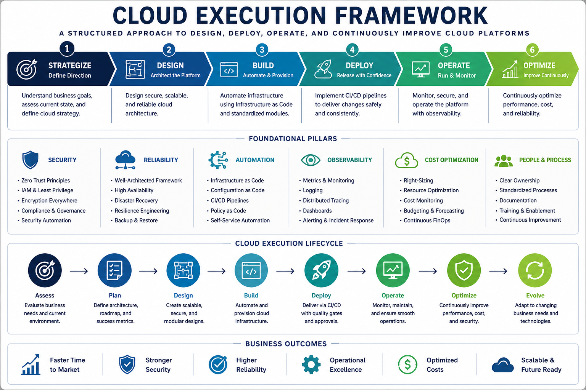

</p>

### Engineering Focus

- Cloud Strategy
- AWS Architecture
- Landing Zones
- Infrastructure Design
- Network Architecture
- Cost Optimization
- Production Readiness

---

## ⚙️ Platform Engineering Blueprint

Modern software delivery depends on internal platforms that enable developers to build, deploy, and operate applications efficiently.

<p align="center">

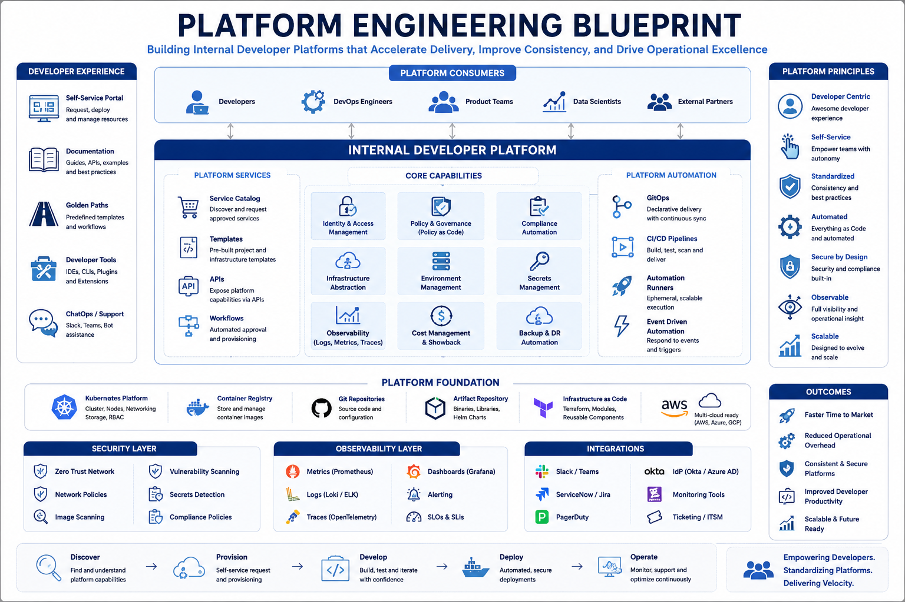

</p>

### Engineering Focus

- Kubernetes Platforms
- Internal Developer Platforms
- GitOps
- Infrastructure Automation
- Self-Service Infrastructure
- Developer Experience
- Production Operations

---

## 🚀 DevOps Delivery Pipeline

Automating software delivery through repeatable, reliable, and secure CI/CD workflows.

<p align="center">

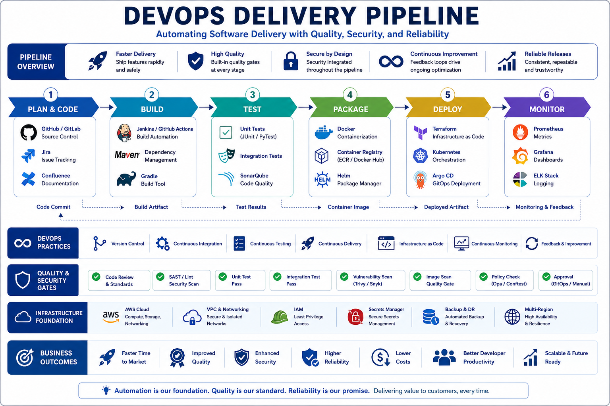

</p>

### Engineering Focus

- Source Control
- Continuous Integration
- Automated Testing
- Containerization
- Infrastructure as Code
- Continuous Delivery
- Production Deployment

---

## 🤖 AI Infrastructure Platform

Modern AI workloads require cloud-native infrastructure capable of supporting model training, inference, observability, and scalable deployments.

<p align="center">


</p>

### Engineering Focus

- AI Platform Architecture
- GPU Infrastructure
- Kubernetes Inference
- Model Serving
- Vector Databases
- API Gateways
- MLOps Foundations

---

## 📊 Observability Platform

Reliable production systems depend on complete visibility into infrastructure, applications, and user experience.

<p align="center">

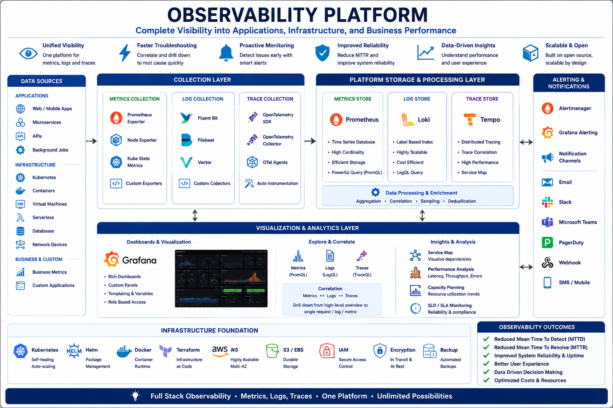

</p>

### Engineering Focus

- Metrics
- Logging
- Distributed Tracing
- Dashboards
- Alerting
- Incident Response
- Capacity Planning

---

## 🔒 Security Architecture

Security is embedded into every layer of the platform—from infrastructure provisioning to production operations.

<p align="center">

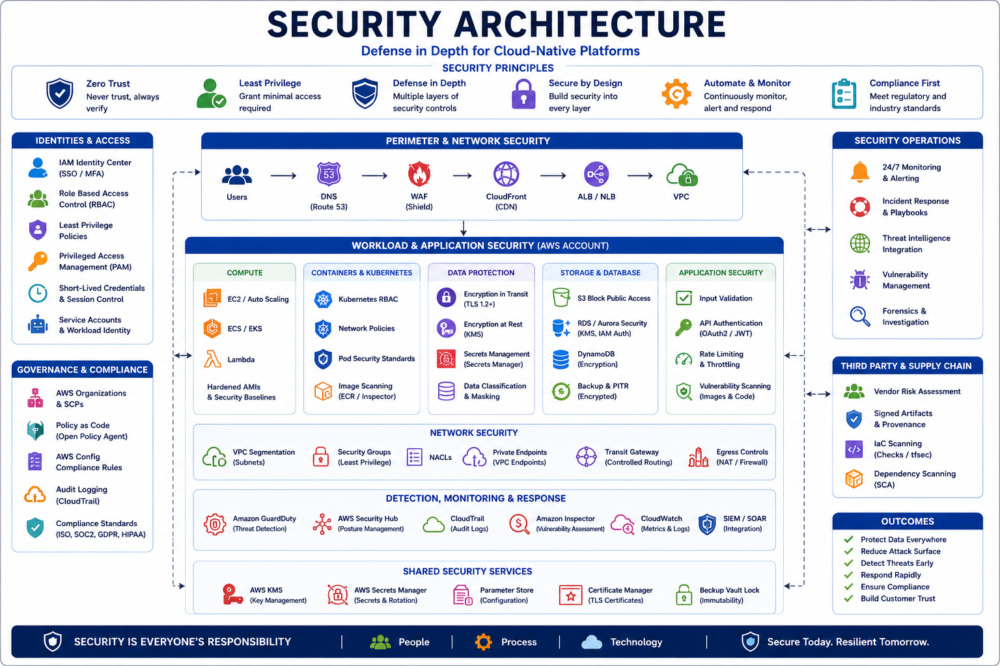

</p>

### Engineering Focus

- Identity & Access Management
- Network Security
- Zero Trust Principles
- Secrets Management
- SSL/TLS
- Infrastructure Hardening
- DevSecOps

<p align="right">
<a href="#top">⬆️ Back to Top</a>
</p>

---

# 🎯 Architecture Design Principles

Every CloudOps Velocity reference architecture is built around the following principles:

| Principle | Objective |
|------------|-----------|
| ☁️ Cloud Native | Build scalable and resilient cloud platforms |
| ⚙️ Platform Engineering | Enable developer productivity through standardized platforms |
| 🤖 Automation First | Minimize manual operations through Infrastructure as Code and CI/CD |
| 🔒 Secure by Design | Integrate security into every engineering layer |
| 📊 Observability | Provide complete operational visibility from day one |
| 📚 Documentation | Treat documentation as an engineering deliverable |
| 📈 Continuous Improvement | Continuously evolve architecture based on operational feedback |

---

## 🌍 Why Reference Architectures Matter

Reference architectures provide a repeatable engineering blueprint that reduces implementation risk, accelerates project delivery, and improves long-term operational consistency.

Rather than designing every solution from scratch, CloudOps Velocity applies proven architectural patterns that can be adapted to different industries, workloads, and business requirements while maintaining engineering best practices.

<p align="right">
<a href="#top">⬆️ Back to Top</a>
</p>

---

# 🤖 AI Infrastructure

Artificial Intelligence is transforming how software is built, deployed, and operated.

However, successful AI adoption depends on much more than selecting a machine learning model. Organizations require reliable infrastructure capable of supporting data pipelines, model deployment, scalable inference, monitoring, governance, and continuous improvement.

CloudOps Velocity focuses on engineering the cloud platforms that enable AI workloads to run reliably in production.

Rather than building isolated AI applications, we build the infrastructure that powers them.

---

# 🚀 AI Infrastructure Lifecycle

Every production AI platform follows a structured engineering lifecycle.

```text
Business Problem
        │
        ▼
Data Platform
        │
        ▼
Model Development
        │
        ▼
Model Registry
        │
        ▼
Containerization
        │
        ▼
Kubernetes Deployment
        │
        ▼
Inference APIs
        │
        ▼
Monitoring
        │
        ▼
Continuous Improvement
```

<p align="right">
<a href="#top">⬆️ Back to Top</a>
</p>

---

# 🏗 AI Platform Architecture

<p align="center">

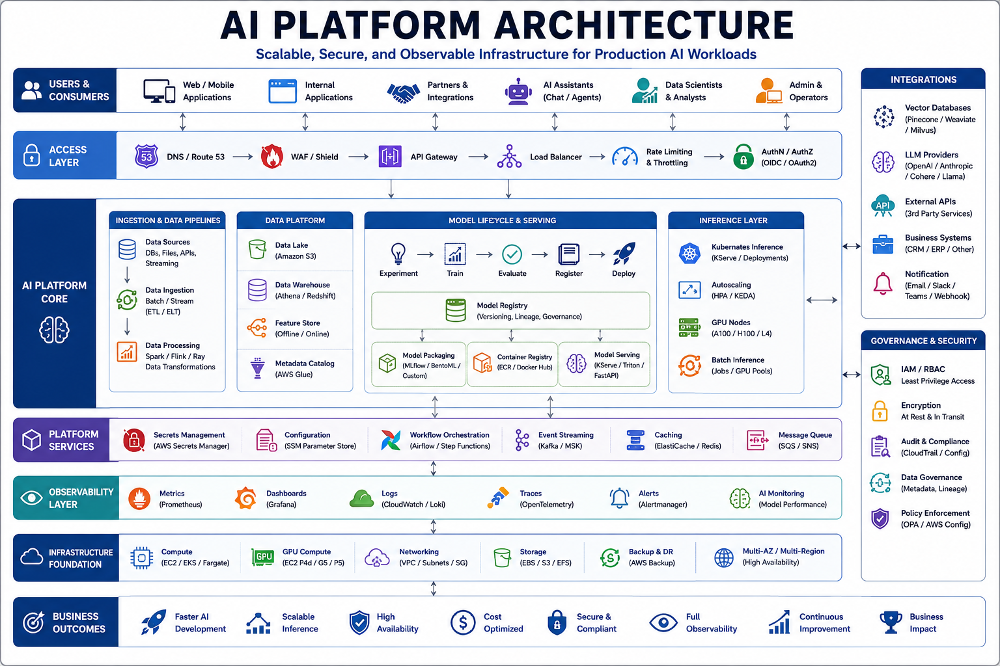

</p>

---

# ⚙️ AI Engineering Capabilities

CloudOps Velocity engineers the infrastructure required to operate modern AI platforms at scale.

| Capability | Description |
|------------|-------------|
| 🧠 Model Deployment | Deploy machine learning models into production environments |
| ☸ Kubernetes Inference | Scalable model serving using Kubernetes |
| ⚡ GPU Infrastructure | Designing cloud environments optimized for accelerated AI workloads |
| 📦 Containerized AI | Packaging models using Docker for consistent deployment |
| 🔄 AI CI/CD | Automating model deployment pipelines |
| 📊 AI Observability | Monitoring model performance, latency, and operational health |
| 📚 Model Registry | Versioning and managing production models |
| 🔐 AI Security | Securing AI workloads, APIs, and infrastructure |

---

# ☁️ AI Infrastructure Components

A modern AI platform consists of multiple engineering layers working together.

```text
Users
        │
        ▼
Applications
        │
        ▼
API Gateway
        │
        ▼
Inference Services
        │
        ▼
Kubernetes
        │
        ▼
GPU Compute
        │
        ▼
Model Registry
        │
        ▼
Vector Database
        │
        ▼
Cloud Storage
```

<p align="right">
<a href="#top">⬆️ Back to Top</a>
</p>

---

# 🛠 Technology Ecosystem

CloudOps Velocity continuously evaluates modern technologies for building production AI platforms.

### AI Frameworks

- FastAPI
- Python
- Ollama
- Llama
- Hugging Face
- OpenAI APIs

---

### Infrastructure

- Kubernetes
- Docker
- AWS
- GPU Compute
- Linux

---

### Data Platforms

- Amazon S3
- PostgreSQL
- Redis
- Vector Databases

---

### MLOps

- Model Registry
- CI/CD
- Monitoring
- Version Control
- Automated Deployment

---

### Observability

- Prometheus
- Grafana
- OpenTelemetry
- Centralized Logging
- AI Metrics

---

# 🎯 Engineering Principles for AI

CloudOps Velocity believes AI infrastructure should follow the same engineering standards as any mission-critical production platform.

Every AI platform should be:

- ✅ Secure
- ✅ Observable
- ✅ Scalable
- ✅ Automated
- ✅ Version Controlled
- ✅ Containerized
- ✅ Cost Efficient
- ✅ Production Ready

---

# 🌍 AI Infrastructure Use Cases

Our AI infrastructure designs support a wide range of enterprise workloads, including:

- Intelligent Customer Support
- Document Processing
- Retrieval-Augmented Generation (RAG)
- Recommendation Engines
- Predictive Analytics
- Internal AI Assistants
- Knowledge Search
- Computer Vision Platforms
- Generative AI Applications

<p align="right">
<a href="#top">⬆️ Back to Top</a>
</p>

---

# 🚀 Our Vision

Artificial Intelligence should not be treated as a standalone application.

It should operate as a core capability of a secure, scalable, observable, and automated cloud platform.

CloudOps Velocity is committed to building the engineering foundations that enable organizations to adopt AI with confidence while maintaining reliability, governance, and operational excellence.

---

# 📚 Engineering Case Studies

CloudOps Velocity believes the best way to demonstrate engineering capability is through real-world implementations rather than marketing claims.

The following case studies showcase practical cloud engineering, platform engineering, automation, and infrastructure modernization initiatives based on real production experience and engineering best practices.

Every case study highlights the engineering challenges, architectural decisions, implementation strategy, and measurable outcomes.

---

## ⭐ [Enterprise Platform Engineering](https://github.com/Siva-Prasad-Palagiri/enterprise-platform-engineering-case-study)

> **Production AWS Platform Engineering Case Study**

A comprehensive engineering case study documenting the design, deployment, automation, monitoring, security, documentation, and operational management of a production AWS platform.

<p align="center">

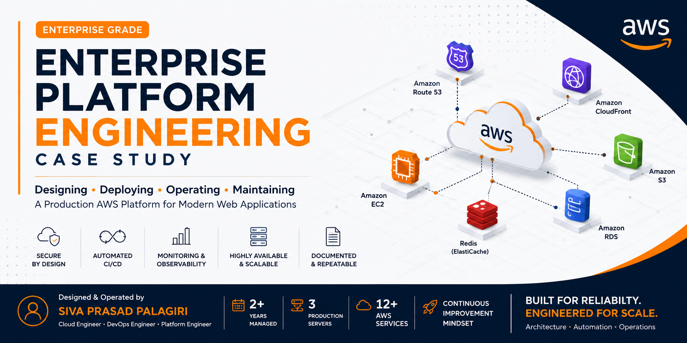

</p>

### Engineering Highlights

- Production AWS Infrastructure
- Cloud Architecture
- CI/CD Automation
- Jenkins Pipelines
- Linux Administration
- NGINX Reverse Proxy
- Amazon Route53
- Amazon CloudFront
- Amazon EC2
- Amazon RDS
- Amazon S3
- Redis
- SSL Automation
- Monitoring & Observability
- Production Operations
- Infrastructure Documentation

### Outcome

A secure, scalable, and highly available production platform supporting real business workloads while improving deployment reliability, operational efficiency, and infrastructure maintainability.

---

# ☸ Kubernetes Platform Engineering

> **Currently in Development**

Designing production-ready Kubernetes platforms that simplify application deployment, scaling, and operational management.

<p align="center">

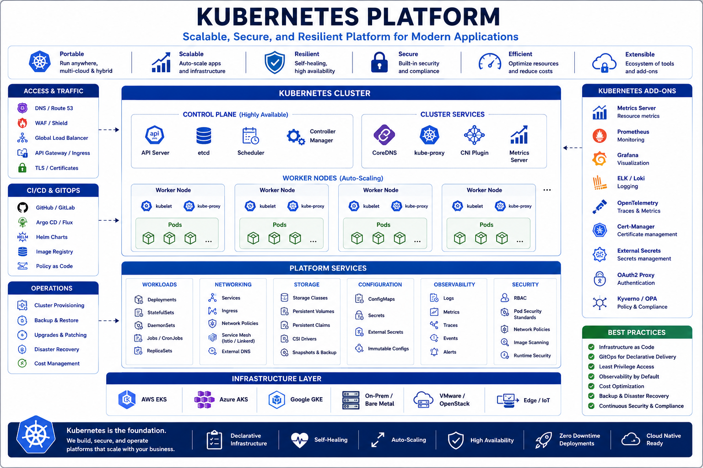

</p>

### Planned Engineering Scope

- Kubernetes Clusters
- Helm Charts
- GitOps
- Argo CD
- RBAC
- Ingress Controllers
- Autoscaling
- Service Mesh Foundations
- Platform Observability

---

# 🏗 Infrastructure as Code

> **Currently in Development**

Building repeatable and version-controlled cloud infrastructure using Infrastructure as Code.

<p align="center">

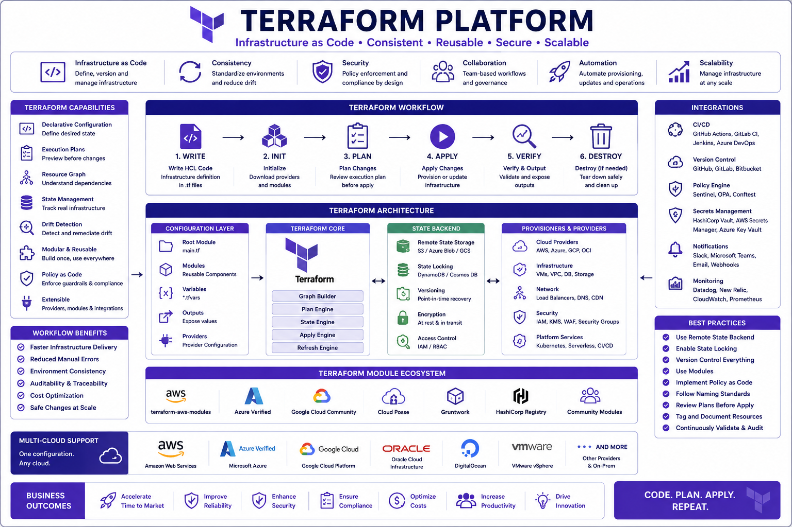

</p>

### Planned Engineering Scope

- Terraform Modules
- AWS Infrastructure
- Networking
- IAM
- Production Environments
- Reusable Infrastructure
- Remote State Management
- Infrastructure Automation

---

# 🤖 AI Infrastructure Platform

> **Currently in Development**

Engineering modern cloud platforms capable of supporting production AI workloads.

<p align="center">


</p>

### Planned Engineering Scope

- GPU Infrastructure
- Kubernetes Inference
- Model Deployment
- Vector Databases
- Retrieval-Augmented Generation (RAG)
- AI APIs
- MLOps
- AI Observability

---

# 🚀 DevOps Automation Platform

> **Currently in Development**

Automating software delivery through modern CI/CD pipelines and Infrastructure as Code.

<p align="center">

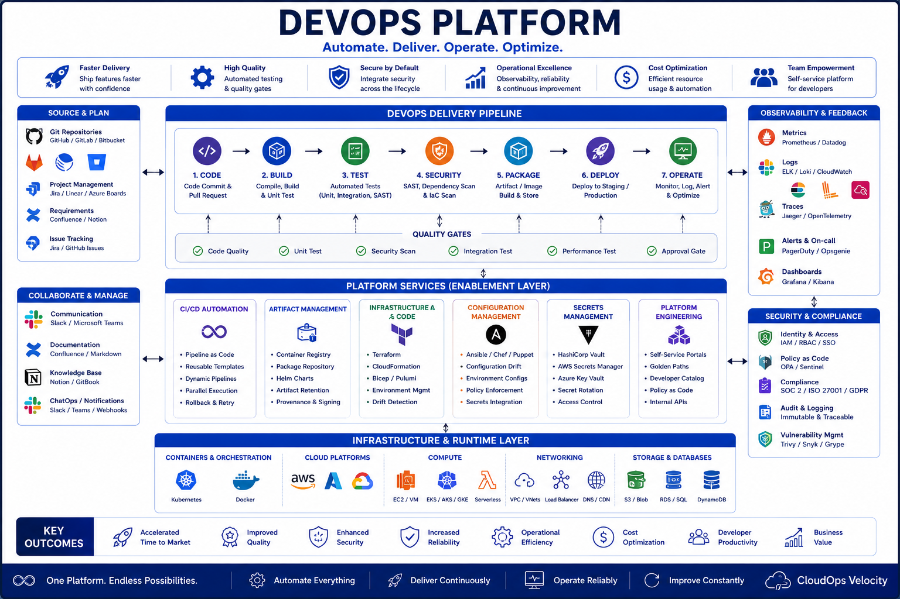

</p>

### Planned Engineering Scope

- GitHub Actions
- Jenkins
- Docker
- Terraform
- Kubernetes
- Progressive Delivery
- Release Automation
- Deployment Strategies

---

# 📊 Observability Platform

> **Currently in Development**

Building enterprise observability platforms that provide complete visibility into cloud-native applications and infrastructure.

<p align="center">


</p>

### Planned Engineering Scope

- Prometheus
- Grafana
- Loki
- Tempo
- OpenTelemetry
- Alerting
- Incident Response
- SRE Dashboards

---

# 🎯 Engineering Outcomes

Every CloudOps Velocity engagement aims to deliver measurable business and engineering value.

| Outcome | Business Impact |
|-----------|-----------------|
| 🚀 Faster Software Delivery | Reduced deployment time through automation |
| 🔒 Improved Security | Secure-by-design cloud platforms |
| 📈 Higher Reliability | Resilient production infrastructure |
| 📊 Operational Visibility | Comprehensive monitoring and observability |
| ⚙️ Standardized Platforms | Improved developer productivity |
| 💰 Cost Optimization | Efficient cloud resource utilization |
| 🤖 AI Readiness | Infrastructure prepared for modern AI workloads |

---

# 🌍 Building the Future

CloudOps Velocity continues to expand its engineering portfolio across Platform Engineering, Kubernetes, Infrastructure as Code, AI Infrastructure, Observability, and Cloud Native technologies.

Each completed initiative becomes part of a growing knowledge base that demonstrates practical engineering experience, architectural thinking, and operational excellence.

<p align="right">
<a href="#top">⬆️ Back to Top</a>
</p>

---

# 📘 Documentation

CloudOps Velocity believes great engineering extends beyond building infrastructure—it includes documenting architecture, operational processes, engineering standards, and implementation decisions.

Our documentation is designed to help engineering teams understand, operate, and continuously improve cloud platforms throughout their lifecycle.

---

# 📚 Engineering Knowledge Base

| Document | Description |
|-----------|-------------|
| 📖 Company Overview | Vision, mission, engineering philosophy, and company capabilities |
| ☁️ Cloud Architecture | AWS reference architectures, networking, high availability, and cloud design principles |
| ⚙️ Platform Engineering | Kubernetes platforms, internal developer platforms, GitOps, and platform automation |
| 🚀 DevOps Automation | CI/CD pipelines, Infrastructure as Code, release automation, and deployment strategies |
| 🤖 AI Infrastructure | AI platform architecture, GPU infrastructure, model deployment, MLOps, and scalable inference |
| 📊 Observability | Monitoring, logging, tracing, dashboards, alerting, and production visibility |
| 🔒 Security | IAM, network security, DevSecOps, secrets management, and security best practices |
| 📚 Case Studies | Production implementations, architecture decisions, engineering outcomes, and lessons learned |

---

# 📂 Repository Documentation Structure

```text
docs/

├── company-overview.md

├── services.md

├── cloud-architecture.md

├── platform-engineering.md

├── devops-automation.md

├── ai-infrastructure.md

├── observability.md

├── security.md

└── engineering-standards.md
```

---

# 🎯 Documentation Principles

Every document published by CloudOps Velocity follows the same engineering standards.

| Principle | Description |
|------------|-------------|
| 📚 Practical | Focused on real engineering implementation rather than theory |
| 🔄 Continuously Updated | Documentation evolves alongside platforms and technologies |
| 🛠 Actionable | Includes implementation guidance, operational considerations, and best practices |
| 🔒 Security Aware | Avoids exposing confidential information while sharing architectural patterns |
| 🌍 Vendor Neutral | Engineering decisions are based on technical requirements and business outcomes rather than vendor preference |
| ⚙️ Engineering Focused | Written for engineers, architects, and technical decision-makers |

---

# 🏗 Documentation Lifecycle

```text
Engineering Requirement
          │
          ▼
Architecture Design
          │
          ▼
Implementation
          │
          ▼
Operational Documentation
          │
          ▼
Continuous Improvement
          │
          ▼
Knowledge Sharing
```

---

# 📖 Engineering Standards

CloudOps Velocity follows modern engineering practices to ensure every platform is designed for long-term success.

Our standards include:

- Infrastructure as Code
- GitOps Principles
- Cloud Native Architecture
- Zero Trust Security
- CI/CD Automation
- Platform Standardization
- Documentation as Code
- Observability by Default
- Production Readiness Reviews
- Continuous Optimization

---

# 🌍 Why Documentation Matters

Documentation is more than project deliverables—it is an engineering asset.

Well-structured documentation enables engineering teams to:

- Accelerate onboarding
- Improve operational consistency
- Reduce implementation risk
- Standardize engineering practices
- Simplify troubleshooting
- Preserve architectural knowledge
- Support long-term platform evolution

At CloudOps Velocity, documentation is treated with the same importance as infrastructure, automation, and software delivery.

---

# 🗺️ Engineering Roadmap

CloudOps Velocity is committed to continuously evolving its engineering capabilities to address the changing needs of modern cloud-native platforms and AI-driven applications.

Our roadmap reflects the strategic direction of the company while remaining grounded in practical engineering, operational excellence, and customer success.

<p align="right">
<a href="#top">⬆️ Back to Top</a>
</p>

---

# 🚀 2026 Roadmap

Our primary focus is establishing CloudOps Velocity as a trusted engineering partner for cloud modernization, platform engineering, and AI infrastructure.

### Cloud Engineering

- ✅ Enterprise Cloud Architecture
- ✅ AWS Platform Engineering
- ✅ Infrastructure Automation
- ✅ CI/CD Engineering
- ✅ Cloud Security
- ✅ Production Operations

---

### Platform Engineering

- 🔄 Kubernetes Platform Engineering
- 🔄 Internal Developer Platforms
- 🔄 GitOps Workflows
- 🔄 Platform Standardization
- 🔄 Self-Service Infrastructure
- 🔄 Platform Automation

---

### Infrastructure as Code

- 🔄 Terraform Modules
- 🔄 Reusable Infrastructure
- 🔄 Landing Zone Automation
- 🔄 Environment Provisioning
- 🔄 Policy as Code

---

### AI Infrastructure

- 🔄 AI Platform Engineering
- 🔄 GPU Infrastructure
- 🔄 Model Deployment Platforms
- 🔄 Kubernetes Inference
- 🔄 Vector Databases
- 🔄 Retrieval-Augmented Generation (RAG)

---

### Observability

- 🔄 OpenTelemetry
- 🔄 Prometheus
- 🔄 Grafana
- 🔄 Distributed Tracing
- 🔄 Centralized Logging
- 🔄 Reliability Dashboards

<p align="right">
<a href="#top">⬆️ Back to Top</a>
</p>

---

# 🌍 Long-Term Vision (2027+)

CloudOps Velocity aims to become a recognized engineering consultancy specializing in Platform Engineering and AI Infrastructure.

Our long-term initiatives include:

## ☁️ Cloud Platforms

- Multi-Cloud Architecture
- Hybrid Cloud
- Cloud Governance
- FinOps
- Disaster Recovery Automation

---

## ⚙️ Platform Engineering

- Enterprise Internal Developer Platforms
- Platform APIs
- Platform Portals
- Developer Experience Engineering
- Golden Paths
- Platform Templates

---

## 🤖 AI Engineering

- Enterprise AI Platforms
- LLM Infrastructure
- AI Gateway
- Agentic AI Infrastructure
- AI Security
- AI Observability

---

## 📊 Reliability Engineering

- Site Reliability Engineering (SRE)
- Chaos Engineering
- Automated Recovery
- Capacity Engineering
- Operational Excellence

---

## 🔒 Security Engineering

- Zero Trust Architecture
- Secrets Automation
- DevSecOps
- Compliance Automation
- Security Observability

<p align="right">
<a href="#top">⬆️ Back to Top</a>
</p>

---

# 📚 Open Source Initiatives

CloudOps Velocity believes in contributing back to the engineering community through open-source projects, technical documentation, architecture references, and engineering best practices.

Planned open-source initiatives include:

- Kubernetes Reference Architectures
- Terraform Modules
- GitHub Actions Templates
- AI Infrastructure Blueprints
- Platform Engineering Guides
- Cloud Architecture Reference Designs
- DevOps Automation Frameworks
- Engineering Documentation Templates

---

# 🎯 Strategic Objectives

Every initiative on our roadmap supports one or more of the following objectives:

| Objective | Focus |
|------------|-------|
| ☁️ Modern Cloud Platforms | Secure, scalable, and reliable cloud infrastructure |
| ⚙️ Platform Engineering | Empower engineering teams through standardized platforms |
| 🤖 AI Infrastructure | Build production-ready foundations for modern AI workloads |
| 🚀 Automation | Reduce manual operations through engineering automation |
| 📊 Observability | Increase visibility across applications and infrastructure |
| 🔒 Security | Embed security into every engineering decision |
| 📚 Knowledge Sharing | Contribute engineering knowledge to the wider community |

---

# 💡 Looking Ahead

Technology evolves rapidly, but strong engineering principles remain constant.

CloudOps Velocity will continue investing in modern cloud-native technologies, Platform Engineering, AI Infrastructure, and operational excellence while remaining focused on solving real engineering problems for customers.

Our vision is simple:

> **Build cloud platforms that are secure, scalable, automated, observable, and engineered for the future.**

<p align="right">
<a href="#top">⬆️ Back to Top</a>
</p>

---

# 🏢 About CloudOps Velocity

CloudOps Velocity is a modern cloud engineering consultancy focused on helping organizations design, build, automate, secure, and operate cloud-native platforms.

Founded on the belief that infrastructure should accelerate innovation rather than create operational complexity, CloudOps Velocity combines Cloud Engineering, Platform Engineering, DevOps, and AI Infrastructure into a unified engineering practice.

Our mission is not simply to migrate workloads to the cloud—but to engineer platforms that enable businesses to deliver software faster, operate with confidence, and continuously evolve as technology advances.

---

# 🌍 Our Mission

To engineer secure, scalable, automated, and observable cloud platforms that empower organizations to innovate with confidence.

We strive to simplify operational complexity through engineering excellence, modern platform practices, and continuous automation.

---

# 👁 Our Vision

To become a globally recognized engineering consultancy specializing in:

- Cloud Engineering
- Platform Engineering
- AI Infrastructure
- Kubernetes Platforms
- Cloud Native Technologies
- Infrastructure Automation

Our vision is to help organizations build cloud platforms that remain reliable, resilient, and future-ready as technology continues to evolve.

---

# 💎 What Makes CloudOps Velocity Different

Unlike traditional infrastructure consulting companies, CloudOps Velocity focuses on engineering complete platforms rather than deploying isolated cloud resources.

Our engineering approach integrates:

- ☁️ Cloud Architecture
- ⚙️ Platform Engineering
- 🚀 DevOps Automation
- 🤖 AI Infrastructure
- 📊 Observability
- 🔒 Security Engineering

into one cohesive platform strategy.

Every engagement is designed to produce systems that are easier to operate, easier to scale, and easier to maintain.

<p align="right">
<a href="#top">⬆️ Back to Top</a>
</p>

---

# 🚀 Our Engineering Values

| Value | Description |
|---------|-------------|
| 🤖 Automation First | Automate repetitive work to improve consistency, speed, and reliability. |
| 🔒 Secure by Design | Build security into every layer of the platform from the beginning. |
| 📈 Reliability Matters | Prioritize resilient systems over unnecessary complexity. |
| 📚 Documentation as Code | Treat documentation as a first-class engineering asset. |
| 📊 Observability by Default | Ensure every platform provides complete operational visibility. |
| 🔄 Continuous Improvement | Continuously optimize platforms based on operational feedback and evolving business needs. |
| ☁️ Cloud Native Thinking | Leverage modern cloud technologies to maximize scalability and resilience. |
| ⚙️ Platform Thinking | Build reusable platforms that empower engineering teams rather than one-off solutions. |

---

# 🌐 Industries We Support

CloudOps Velocity engineering practices are applicable across a wide range of industries, including:

- Financial Services
- Healthcare
- Retail & eCommerce
- Software as a Service (SaaS)
- Artificial Intelligence
- Manufacturing
- Education
- Logistics
- Startups
- Enterprise Technology

---

# 🤝 Our Commitment

Every engagement is guided by three simple commitments:

### Engineering Excellence

Design systems that are reliable, maintainable, and scalable.

---

### Operational Simplicity

Reduce complexity through automation, standardization, and modern engineering practices.

---

### Long-Term Partnership

Build platforms that continue delivering value long after the initial deployment.

---

# 🚀 Engineering Simplicity. Delivering Velocity.

CloudOps Velocity exists to help organizations transform cloud infrastructure into reliable engineering platforms that accelerate innovation, strengthen operational resilience, and prepare businesses for the future of cloud-native computing and artificial intelligence.

<p align="right">
<a href="#top">⬆️ Back to Top</a>
</p>

---

# 📩 Contact

Whether you're modernizing cloud infrastructure, building an internal developer platform, adopting Kubernetes, implementing CI/CD automation, or preparing your organization for AI-driven workloads, CloudOps Velocity is ready to help.

We welcome conversations with startups, growing businesses, enterprises, engineering leaders, recruiters, and technology partners who are passionate about building reliable cloud platforms.

---

# 🌐 Connect With Us

<p align="center">

<a href="https://cloudopsvelocity.com">

</a>

<a href="https://www.linkedin.com/company/cloudops-velocity">

</a>

<a href="mailto:info@cloudopsvelocity.com">

</a>

</p>

---

# 💼 Engineering Services

CloudOps Velocity provides engineering expertise across:

- ☁️ Cloud Architecture
- ⚙️ Platform Engineering
- 🚀 DevOps & CI/CD Automation
- ☸ Kubernetes Platforms
- 🏗 Infrastructure as Code
- 📊 Monitoring & Observability
- 🔒 Cloud Security & DevSecOps
- 🤖 AI Infrastructure & MLOps

---

# 🤝 Collaboration

We are open to collaborating with:

- Startups building cloud-native products
- Organizations modernizing legacy infrastructure
- Engineering teams adopting Platform Engineering
- Businesses implementing Kubernetes
- AI startups building production infrastructure
- Technology consulting partners
- Open-source communities
- Enterprise cloud transformation initiatives

---

# 🌍 Headquarters

**CloudOps Velocity**

Dubai, United Arab Emirates *(Expansion)*

Bengaluru, India *(Engineering Operations)*

🌐 **Website:** https://cloudopsvelocity.com

📧 **Email:** info@cloudopsvelocity.com

<p align="right">
<a href="#top">⬆️ Back to Top</a>
</p>

---

# 🚀 Let's Build the Future Together

Whether you're launching your first cloud platform or modernizing enterprise-scale infrastructure, CloudOps Velocity is committed to engineering solutions that are secure, scalable, automated, and built for long-term success.

We don't just deploy infrastructure.

**We engineer platforms that enable innovation.**

---

---

# ⚖️ License

This repository is licensed under the **MIT License**.

See the [LICENSE](LICENSE) file for complete details.

---

<p align="center">

## CloudOps Velocity

### Engineering Simplicity. Delivering Velocity.

Cloud Execution • Platform Engineering • AI Infrastructure

---

⭐ **If you found this repository valuable, please consider giving it a Star.**

It helps us share engineering knowledge with the broader cloud-native community.

---

© 2026 CloudOps Velocity. All Rights Reserved.

🌐 https://cloudopsvelocity.com

</p>

<p align="right">
<a href="#top">⬆️ Back to Top</a>
</p>